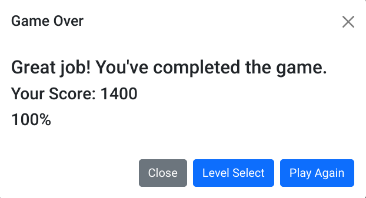
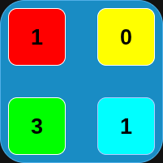
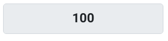
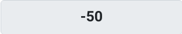

# Memory Bank

## About the Game
This game was inspired by the Human Benchmark game where you have a sequence of squares appear on the screen and you have to follow the pattern in order to get points. The more you get correct the more points you acrue over time. This game is to test your memory and eventually it will test your cognitive functions, such as reaction time to gauge where you are at personally. This game is designed in a way where any age group could play it to work on their ability to retain information and replay it. Also, sometimes these memory test can be seen during the pre-screening phase of a graduate role in IT. They will use a series of games and test your ability to retain information and use it to progress through the game. However, for this instance, the memory game will be the main focus of this website.

## UX
### Project Goals
- Challenge the user's capability to remember random sequence.
- Create a game that has an increasing level of difficulty for each round the user passes.
- Create multiple levels that increase in dimensions of squares the user has to play.
- Create easy navigation for the user to move around the website.
- Create 5 levels ranging from a 2x2 grid to a 4x4 grid.
- Making the game difficulty at a manageable level, making it more accesible to more players.
- Create a basic how to play screen

#### Player Goals
The intended audience for the game is for anyone who wants to assess their cognitive abilities. One target audience might also be job seekers looking for a role in IT as some companies require you to do an IQ test or a series of activities and questionnaires to assess if you're a right fit for the company. Being able to retain and reproduce information is one of the more important things to work on and it's the one game type that I tend to practice that game mode the most. It mainly targets short term memory as you need to look at a sequence and replay the same order of inputs as shown to the user.

From applying for many different graduate IT roles, one of the common games was something in relation to short term memory or working with information and using it. Since, it is relevant to me it can be relevant to other graduate students or prospective interns looking for work in the IT industry.

The player goals are:
- Fun games that can challenge their memory
- Games that can challenge their problem solving abilities
- Games that can challenge how good their short term memory is to replay the sequence they saw
- Easy to read buttons
- Clear indication of how well the user is doing

The developer goals are:
- Adequately increase the difficulty on each level
- Make the increase in difficulty gradual and not too difficult
- Ensure that the website is easy to navigate
- Make the user have easy indication of when they are right/wrong

### Research
From looking at other memory games, I had noticed a lot of different functionalities that seemed interesting. One of the more notable examples was Human Benchmark. One of the more interesting things that they had in their game was a way to build on their previous sequence and keep adding one more item to the sequence the user started with. They also added some audio cues to help the user remember which block to press.


The game starts with flashing one square and the game starts to create a longer sequence building off of the previous squares the user can remember. I like this idea but I will take my own spin on it by making each square a different colour and indicate a duplicate square in the series by placing a number on each square indicating that. Instead of having just one continuous level, I will have multiple levels with different grid matrixes from 2x2 to 4x4 with a cap on the increasing difficulty.

### User Stories
- As a player, I want to be able to play it on my phone.
- As a player, I want the levels to increase in difficulty
- As a player, I want immediate visual feedback after input my sequence so I know if I am correct or wrong
- As a player, I want the sequence to lengthen after each round.
- As a player, I would like a summary screen for after
- As a player, I want to be able to see my current score as time the game progresses.
- As a player, I would like a how to play screen to know how the game works.

### Wireframes
For this website, I want it to be more JavaScript heavy rather than design heavy so one of the things I will work towards is just using a simplistic design but still doing the best I can to make it pass all the validator pass checks. This game is more geared towards the mobile view but it can be played on desktop, mobiles and tablets. Here is the mobile view of the wireframe:


As you can see the basic design is a hero on the landing page with an easy and visible button that should re-route the user to the level select window. When you click one of the levels it will make the user navigate to the game window where you have to click the start button and the game will start working. For any levels that haven't been completed yet, the user will be sent to the coming-soon page which should redirect the user to back to the level select screen or back to the homepage screen.

#### Home Page


#### Level 1


#### Level 2


#### Level 3


#### Level 4


#### Level 5


#### How to Play


#### Level Select


### Level Design
#### Level 1
This level should be a simple 2x2 easy to follow level which has distinct colours, displays each item at a reasonable pace and, has an indication on the buttons for any repeats in the sequence. It's gonna have a maximum of 4-5 rounds to get through where each sequence gets longer by 1 item and the user enters each item in the exact order it is shown.

#### Level 2
This level is a slight increase in difficulty, just like level 1 the user will have to get through 4-5 rounds of sequences each one getting longer the more rounds that the user passes. The main difference is that it is now a 3x3 game mode. It still has the indication of any duplicate items in the sequence to the user by a number on the buttons.

#### Level 3
This level is a bit more difficult than the last one. Just like how level 2 has a 3x3 grid to follow and 4-5 rounds to get through. However, the twist is that the button labels to indicate a repeat in the sequence has been removed and instead every other repeat item in the sequence makes the square turn black. For example, 43331 would make square 3 turn yellow, black and then yellow again. Additionally, the speed of the sequence is increased a bit to make it more challenging.

#### Level 4
Thus level increases the difficulty a tad bit more in comparison to the previous level. The difference between this level and the last is that all squares are now the same colour, the speed of the sequence is increased again and it retains the same alternating pattern for repeat items in the sequence.

#### Level 5
This is the hardest level altogether. It starts off slow but gradually increases in speed every set amount of rounds. It also gives the user some lives. Every wrong input takes one life away and makes the code replay the sequence that they got wrong. When they get all inputs right, the sequence will get longer by 1.

#### How to Play
This screen just has a basic explanation of all the levels designed above in a digestible form.

### Must Haves
- Scoreboard for the current score
- How to play screen
- Easy to navigate how to play screen
- Responsive Design
- Clear indication of correct inputs and wrong inputs

### Should have
- At least 4 levels
- Redirect for webpages or unaccounted for path directions or coming soon pages.
- Basic Hero on home page
- API call for icons
- Indicate a correct answer by changing background colour
- Infinite auto incrementing final level

### Nice to haves
- High score storing the user's best score as a cookie
- Graphs to compare the average score of user to the average person in a certain age group
- Reaction time game
- Scoreboard number flash red when score decrements and flash green when it increments

Other game modes that would be a nice to have are in the features left to implement section.

## Features
In the features section I will explain what I have implemented into the game and how the features interact with each other to make the game work. In the functions section there are small differences between how the functions work to make the game run as well as small optimisations for things that require alot more data and individual conditions as the complexity increases.
### Functions (Level 1-3)
#### **`getRandomIntInclusive()`**
```
function getRandomIntInclusive(min, max) {
    const minCeiled = Math.ceil(min);
    const maxFloored = Math.floor(max);
    return Math.floor(Math.random() * (maxFloored - minCeiled + 1) + minCeiled); // The maximum is inclusive and the minimum is inclusive
}
```
This function is from this website:
[Math.Random() functions](https://developer.mozilla.org/en-US/docs/Web/JavaScript/Reference/Global_Objects/Math/random)

What this function does is that it creates a random integer from a given range between min and max including the min and max numbers. This function is important for creating a sequence of numbers for the sequenceMatch game to play.

#### **`HideButtonX()`**
```
function hideButton1(){
    if(shownSequence === false){
        let button = document.getElementById("shape1");
        button.style.visibility = "hidden";
    }else{
        pointCheck(1);
    }
}
```
This function grabs an individual button and depending on whether there is a sequence being shown to the user it hides the button. If the sequence has been shown already or shownSequence is set to true, the function sends the specific button's number index to the **`pointCheck()`**. This function will be activated on whatever button it is assigned to but the naming convention instead of **`hideButtonX()`** it would instead be **`hideButton1()`** for button 1 for example.

#### **`ShowButtonX()`**
```
function showButton1(){
    let button = document.getElementById("shape1");
    button.style.visibility = "visible";
}
```
This function sets the button to visible. The normal naming convention instead of **`showButtonX()`** it would instead be **`showButton1()`** if it's for `button 1`.

#### **`hideButtons()`**
```
function hideButtons(){
    hideButton1();
    hideButton2();
    hideButton3();
    hideButton4();
}
```
This function hides all buttons simulatenously.

#### **`showButton()`**
```
function showButton(){
    showButton1();
    showButton2();
    showButton3();
    showButton4();
}
```
This function shows all buttons simultaneously.

#### **`generateSequence()`**
```
function generateSequence(){
    for (let i = 0; i < maxInputs; i++){
        sequenceToMatch.push(getRandomIntInclusive(1,numberOfSquares));
    }
}
```
This function runs a for loop using the `maxInputs` variable as the condition for how many iterations to run through. `maxInputs` is a variable that sets how many buttons are in the sequence. For example, with level 1 the initial value assigned to `maxInputs` is set to 2 meaning the initial sequence will only have 2 values. So, this for loop will only have 2 iterations and push 2 random numbers onto the **`sequenceToMatch`** array using the **`getRandomIntInclusive()`** function. Inside of the for loop, the code uses the range between 1 and numberOfSqaures. Depending on the level, the webpage will have a different amount of buttons and a different js file. Level 1 uses the js file `script-game.js` and in that `numberOfSquares` would be equal to 4, level 2 `numberOfSquares` is set to 9 and level 3 will eventually be set to 16 which would be the max number of squares irregardless of difficulty, the difficulty will be increased in other ways.

#### **`startMemorySequence()`**
```
function startMemorySequence(){
    document.getElementById('startBtnL2').disabled = true;
    sequenceToMatch = [];
    for (const t of activeTimeouts) clearTimeout(t);
    activeTimeouts = [];
    shownSequence = false;
    i=0;
    if(maxInputs <= lastRound){
        hideButtons();
        generateSequence();
        showButtonsPeriodically();
    }else{
        showEndGameModal();
        return;
    }
}
```
This function starts everything up and resets all the relevant variables and data structures that may cause bugs if not emptied.  This function is attached to the `startBtn` button using the `onclick` event. The function also disables the `startBtn` button to ensure that you can't start playing multiple sequences on top of each other. It also clears any timers so that there isn't any overlapping old timers that aren't being used. It also sets `shownSequence` to false to allow for other functions to work amd replay the sequence created by **`generateSequence()`**. `i` is set to 0 as it will be the iterator for the **`showButtonsPeriodically()`** function.
```
if(maxInputs <= lastRound){
    hideButtons();
    generateSequence();
    showButtonsPeriodically();
}else{
    showEndGameModal();
    return;
}
```
Just to break down this if statement, `if(maxInputs <= lastRound)` checks whether `maxInputs` (which is the max number of squares in a sequence for a round) is less than the `lastRound` variable which is amount of squares going to be shown in the final round. For as long as condition is met, each round the game will hide the buttons, generate the sequence and then display the generated sequence on the screen using **`showButtonsPeriodically()`** function. If the condition isn't met (due to maxInputs being greater than lastRound) then it will show a modal window `showEndGameModal()` which will play an instance of `endGameModal` modal window.

#### **`showEndGameModal()`**
```
function showEndGameModal(){
    document.getElementById('finalScore').textContent = points;
    let percent = parseInt((points/highestScorePossible)*100);
    let percentScore = `${percent}%`;
    document.getElementById('finalPercentScore').textContent = percentScore;
    const endModal = new bootstrap.Modal(document.getElementById('endGameModal'));
    endModal.show();
}
```
This function sets all the score related variables and calculates the user's overall accuracy in percentage form and sets it to the elements in the modal window. It also uses the Bootstrap API to call a new modal instance using the HTML Modal container I created in HTML. This is the HTML that the function will recreate:
```
<div class="modal fade" id="endGameModal" tabindex="-1" aria-labelledby="endGameModalLabel" aria-hidden="true">
    <div class="modal-dialog modal-dialog-centered">
      <div class="modal-content rounded-4 shadow">
        <div class="modal-header border-bottom-0">
          <h1 class="modal-title fs-5" id="endGameModalLabel">Game Over</h1>
          <button type="button" class="btn-close" data-bs-dismiss="modal" aria-label="Close"></button>
        </div>
        <div class="modal-body">
          <h3>Great job! You've completed the game.</h3>
          <h4>Your Score: <span id="finalScore">0</span></h4>
          <h4><span id="finalPercentScore">0%</span></h4>
        </div>
        <div class="modal-footer border-top-0">
          <button type="button" class="btn btn-secondary" data-bs-dismiss="modal">Close</button>
          <button type="button" class="btn btn-primary" onclick="window.location.href='level-select.html'">Level Select</button>
          <button type="button" class="btn btn-primary" onclick="restartGame()">Play Again</button>
        </div>
      </div>
    </div>
</div>
```
And here is the Modal window when it is activated:


#### **`restartGame()`**
```
function restartGame(){
    const modalElement = document.getElementById("endGameModal");
    const modalInstance = bootstrap.Modal.getInstance(modalElement);
    if(modalInstance){
        modalInstance.hide();
    }
    maxInputs = 2;
    points = 0;
    updateScoreBoard();
    sequencePoints = 0;
    shownSequence = false;
    startMemorySequence();
}
```
Firstly, this function is attached to the `Play Again` button on the modal below. When it is clicked, the function assess whether there is a modal window open and since you can see the modal window most of the time (if there aren't any major bugs or misspellings for element names) and passes it into the `if(modalElement)` statement. If it's not empty (it most likely isn't) then the modal window is hidden and the game starts up again. It also resets all of the necessary variables like **`maxInputs`**, **`points`**, **`sequencePoints`** and **`shownSequence`** boolean. And it restart the sequence shown to the user just like it did the first go round.


#### **`showButtonsPeriodically()`**
```
function showButtonsPeriodically(){
    setTimeout(function() {
        i=i+1;
        if(i<maxInputs+1 && sequenceToMatch){
            const current = sequenceToMatch[i - 1];
            const prev = sequenceToMatch[i - 2];
            if (current === prev) {
                repeatCount++;
            } else {
                repeatCount = 1;
            }
            const squareElement = document.getElementById("square-label" + current);
            if (squareElement) {
                squareElement.innerText = repeatCount;
            }
            if(sequenceToMatch[i-1] === 1){
                showButton1();
                const t = setTimeout(() => {hideButton1();
                }, 2000);
                activeTimeouts.push(t);
            }else if(sequenceToMatch[i-1] === 2){
                showButton2();
                const t = setTimeout(() => {hideButton2();
                }, 2000);
                activeTimeouts.push(t);
            }else if(sequenceToMatch[i-1] === 3){
                showButton3();
                const t = setTimeout(() => {hideButton3();
                }, 2000);
                activeTimeouts.push(t);
            }else if(sequenceToMatch[i-1] === 4){
                showButton4();
                const t = setTimeout(() => {hideButton4();
                }, 2000);
                activeTimeouts.push(t);
            }else{
                console.log("Something is wrong");
            }
            showButtonsPeriodically();
        }else if(i>=(maxInputs+1) && sequenceToMatch){
            showButton();
            shownSequence = true;
            i=0;
        }
    },2000)
}
```
This is the beating heart and one of the most important functions that help make the game run. It combines all the prior functions and uses them together to make the button sequence run and show it to the user. This function works like a for loop but instead of using the normal `for (let i=0; i<x; i++ )` format, it uses recursion which instead of automatically incrementing with the for loop, the function instead calls itself if the condition is met; the condition for this function is `if(i<maxInputs && sequenceToMatch)` which checks if the iterator `i` is not greater than the maximum buttons stored in the `sequenceToMatch` array. If the iterator is greater or equal to `maxInputs` then the function will not access the sequence functionality and instead shows all the buttons in the `game-box` container and change the **`shownSequence`** boolean to true. Also, every iteration has a 2 second pause between each one to give the user enough time to remember the button shown to them. This is done by **`setTimeout()`**.

To break down the actual functionality for showing the sequence, here is the code:
```
const current = sequenceToMatch[i - 1];
const prev = sequenceToMatch[i - 2];
if (current === prev) {
    repeatCount++;
} else {
    repeatCount = 1;
}
const squareElement = document.getElementById("square-label" + current);
if (squareElement) {
    squareElement.innerText = repeatCount;
}
```
The code above checks whether there are repeat numbers in the sequence and indicates it on the buttons. For example, if the sequence is: 43331. The code would increment the `repeatCount` number on the buttons on each iteration so the user can actively see where it repeats in the sequence. This is done by checking the current and previous item in the list. So once the sequence is over you could see something like the diagram below:



As you can see, the numbers on the squares all display the repeat values on the buttons and would function exactly the same in the real game. It would use the `square-labelX` x being the current number in the sequence for example, if it is **`sequenceToMatch[1]`** and **`sequenceToMatch[2]`** and both are equal to 3, the repeatCount (which equals 2) would be attacked to **`#square-label2`**.

```
if(sequenceToMatch[i-1] === 1){
    showButton1();
    const t = setTimeout(() => {hideButton1();
    }, 2000);
    activeTimeouts.push(t);
}else if(sequenceToMatch[i-1] === 2){
    showButton2();
    const t = setTimeout(() => {hideButton2();
    }, 2000);
    activeTimeouts.push(t);
}else if(sequenceToMatch[i-1] === 3){
    showButton3();
    const t = setTimeout(() => {hideButton3();
    }, 2000);
    activeTimeouts.push(t);
}else if(sequenceToMatch[i-1] === 4){
    showButton4();
    const t = setTimeout(() => {hideButton4();
    }, 2000);
    activeTimeouts.push(t);
}else{
    console.log("Something is wrong");
}
showButtonsPeriodically();
```
After the check on whether there are repeats numbers in the sequence, the next thing to check is what number matches to what. If the current item in this iteration is a certain number, the corresponding square/button is shown. For example, if the sequence has 1 in that current iteration, then **`showButton1()`** will be used to show `button1`. Then a 2 second timer is used to give the user a bit of time to remember the button shown. Then adter the **`setTimeout()`** timer is over then **`hideButton1`** is shown straight after. It is then stored into the **`activeTimeouts`** array which would later make it easier to clear all of the previous timers for the next round. After, all of that the **`showButtonsPeriodically()`** function is called again and goes through all the same if statements and the iterator `i` is incremented after each recursion call.

#### **`updateScoreBoard()`**
```
function updateScoreBoard(){
    document.getElementById("scoreBoard").value = points;
}
```
This update the score on the front end and increments or decrements on each correct choice the user makes. This function is used in the **`pointCheck()`** function which will be explained later. But when the user gets something right they get 100 points.



When the user chooses the wrong button in the sequence they get -50 points.



#### **`pointCheck(square)`**
```
function pointCheck(squareX){
    let curSquare = sequenceToMatch.shift();
    if(squareX === curSquare && curSquare){
        points = points + 100;
        sequencePoints+=100;
        updateScoreBoard();
        if(playerInputs === maxInputs){
            changeBackgroundColor(sequencePoints);
            setTimeout(() => {changeBackgroundColor(1000000);
                }, 500);
            correctInputs = 0;
            playerInputs = 0;
            sequencePoints = 0;
            maxInputs+=1;
            startMemorySequence();
            resetButtons();
        }
    }else if (squareX !== curSquare && curSquare){
        points = points - 50;
        sequencePoints-=50;
        updateScoreBoard();
        playerInputs+=1;
        if(playerInputs === maxInputs){
            changeBackgroundColor(sequencePoints);
            setTimeout(() => {changeBackgroundColor(1000000);
                }, 500);
            correctInputs = 0;
            playerInputs = 0;
            sequencePoints = 0;
            maxInputs+=1;
            startMemorySequence();
            resetButtons();
        }
    }else{
        console.log("Empty array or something went wrong");
    }
}
```
This is the whole function. At the very beginning, the function uses **`shift()`** function which grabs the first item in the array. The function is used on the **`sequenceToMatch`** array and assigns the first item to **`curSquare`**. Eventually, the **`sequenceToMatch`** array will be completely empty. I will split into 2 which one side handles when the user choose the right square and the when user chooses the wrong square.

**When the user is right:**
```
if(squareX === curSquare && curSquare){
    points = points + 100;
    sequencePoints+=100;
    updateScoreBoard();
    if(playerInputs === maxInputs){
        changeBackgroundColor(sequencePoints);
        setTimeout(() => {changeBackgroundColor(1000000);
            }, 500);
        correctInputs = 0;
        playerInputs = 0;
        sequencePoints = 0;
        maxInputs+=1;
        startMemorySequence();
        resetButtons();
    }
}
```
If **`squareX`** is the same as the **`curSqaure`** variable (the new first item in the **`sequenceToMatch`** array) the user's points will increment by 100 and the round points variable being **`sequencePoints`** will increment by 100. The **`sequencePoints`** variable will be essential for the **`changeBackgroundColor()`** function when showing to the user the degree to how correct they were. The score board is incremented by 100 using the **`updateScoreBoard()`** function and assigned to the scoreboard on the game window. If the user has entered a full sequence of their own, with the maximum amount of values in the sequence, the amount of points gotten for the whole round will be sent to the **`changeBackgroundColor()`** with the **`sequencePoints`** in the paremeters. Depending on how well the user matched the sequence the screen will flash a certain colour, then after half a second the screen will turn back to white. `maxInputs` will increment by 1, reset all the necessary variables, reset button labels to display 0 and start the next sequence.

**When the user is wrong:**
```
else if (squareX !== curSquare && curSquare){
    points = points - 50;
    sequencePoints-=50;
    updateScoreBoard();
    playerInputs+=1;
    if(playerInputs === maxInputs){
        changeBackgroundColor(sequencePoints);
        setTimeout(() => {changeBackgroundColor(1000000);
            }, 500);
        correctInputs = 0;
        playerInputs = 0;
        sequencePoints = 0;
        maxInputs+=1;
        startMemorySequence();
        resetButtons();
    }
}
```
When the user is wrong, it works in a similar way. Instead of adding 100 points it decrements by 50 points and gets updated on the scoreboard. When the user has entered the corresponding amount of items in the sequence, the function will call the **`changeBackgroundColor()`** function and depending on how many many right or wrong buttons they selected in correspondance to the to sequence the background colour will change depending on the degree of correctness (most likely between yellow and red since you can only have a green background if you match every item in the sequence perfectly). It then calls the **`changeBackgroundColor()`** function again within a half a second delay which will change it back to white or the original colour before showing how right they are. After that the `sequencePoints, playerInputs` and `correctInputs` variables are reset to 0, the length of the sequence increments by 1 with the `maxInputs+=1` statement then the next sequence is played with the **`startMemorySequence()`** function and the buttons are reset with the **`resetButtons()`** function.

#### **`resetButtons()`**
```
function resetButtons(){
    for (let i=0; i<9;i++){
        document.getElementById(`square-labelX${i+1}`).innerText = 0;
    }
}
```
After the **`showButtonsPeriodically()`** function runs, the labels on the buttons need to be reset to ensure that there isn't any confusing overlap on how often the button shows in the sequence. To make this happen all of the buttons labels are reset to 0 right after the user has done entering the sequence they remember seeing. In level 2, the general variable naming convention for each button label is `square-labelX1, square-labelX2` each level has their own js file. For the level one button labels, the variable names are `square-babel1, square-label2` and each function will be amended to match the html files button labels.

#### **`changeBackgroundColor(levelOfAccuracy)`**
```
function changeBackgroundColor(levelOfAccuracy){
    const maxPointsPossible = maxInputs * 100;
    if(typeof levelOfAccuracy == "number"){
        if(levelOfAccuracy === 1000000){
            document.body.style.backgroundColor = "white";
        }else if(levelOfAccuracy === maxPointsPossible){
            document.body.style.backgroundColor = "#2bd42f"
        }else if(levelOfAccuracy < maxPointsPossible && levelOfAccuracy >= (maxPointsPossible*0.75)){
            document.body.style.backgroundColor = "#d5e41b";
        }else if(levelOfAccuracy < (maxPointsPossible *0.75) && levelOfAccuracy >= (maxPointsPossible*0.5)){
            document.body.style.backgroundColor = "#f1990e";
        }else if(levelOfAccuracy < (maxPointsPossible * 0.5) && levelOfAccuracy >= (maxPointsPossible*0.25)){
            document.body.style.backgroundColor = "#ff6000";
        }else if(levelOfAccuracy < (maxPointsPossible *0.25)){
            document.body.style.backgroundColor = "#ff1300";
        }else{
            console.log("No colours left");
        }
    }else{
        console.log("Invalid levelOfAccuracy: ", levelOfAccuracy);
    }
}
```
This function indicate to the user how well they matched to the sequence by making the screen flash a certain colour. The value that gets passed through the parameter is `sequencePoints` which is the amount of points the user got for the most recent sequence. The `maxPointsPossible` variable is the maximum amount of points the user could achieve for that round which uses `maxInputs` which is the amount of items in the sequence, which is multiplied by 100 which is the points you get for each right choice. For example, if there are 3 items in the sequence, `maxPointsPossible` is set to `3 * 100` so the max points the user could achieve is **300** points for that round. Now depending on the level of accuracy the user will get the following:
- Green for 100% correctness
- Yellow for 75% correctness
- Orange for 50% correctness
- Red/Orange for 25% correctness
- Red for anything less than 25%

It works in tandem with the **`pointCheck(square)`** function to indicate to the user their level of correctness.

### Function (Level 3+)
The functions for these levels have been optimised to handle a wider range of values with less functions altogether. Here are the functions in action and I will show the different ways it's been implemented in level 3 and onwards.

#### **`hideButtonX()`**
```
function hideButtonX(buttonID){
    console.log("Button pressed");
    if(typeof buttonID == 'number'){
        if(shownSequence === false){
            let button = document.getElementById(`shapeY${buttonID}`);
            button.style.visibility = "hidden";
        }else{
            pointCheck(buttonID);
        }
    }
}
```
In level 1 and 2, the functions used multiple individual functions for each button. For example, button 1, 2, 3 and 4 had the functions: **`hideButton1(), hideButton2(), hideButton3(), hideButton4()`**. In level 3 onwards, the function that handles hiding the buttons is now **`hideButtonX()`** which instead of having each button have a matching function, every button will be hidden by one function. In the .html file the **`onclick`** event stores the function **`hideButtonX(1)`** for button 1 which significantly reduces the redundant code needed to work for a specific button. The function works exactly the same as the original **`hideButton1()`** function but now there are `template literals` that match the specific variable to the button clicked. For example, to get button 1, the code uses the `buttonID` variable to add 1 to the string making it `shapeY1`, when the code is in action.

#### **`showButtonX()`**
```
function showButtonX(buttonID){
    if(typeof buttonID == "number"){
        let button = document.getElementById(`shapeY${buttonID}`);
        button.style.visibility = "visible";
    }
}
```
Similar to **`hideButtonX()`**, it uses `template literals` to make a string more in line with the chosen button. When the code is trying to show button 1, the code sends the chosen button through the parameter instead. For example, **`showButtonX(1)`** will make button 1 appear. Both **`hideButton()`** and **`showButton()`** are all replaced by **`hideButtonX(buttonID)`** and **`showButtonX(buttonID)`** in every function (especially in the **`showButtonPeriodically()`** function) that needs to hide or show buttons.

#### **`hideButtons()`**
```
function hideButtons(){
    for(let i=0; i<numberOfSquares; i++){
        hideButtonX(i+1);
    }
}
```
In the old **`hideButtons()`** function I called all of the **`hideButton1(), hideButton2(), hideButton3(), hideButton4()`** functions in this function, but to make it a little easier I used a for loop instead which just uses the index `i` in the parameter to call each function. `i+1` is there just to ensure that buttons 1-9 are called since there is no button 0. Using the `numberOfSquares` variable as the condition instead of a number just makes it easier to change the amount of squares in the global variable at the beginning of the code.

#### **`showButtons()`**
```
function showButtons(){
    for(let i=0; i<numberOfSquares; i++){
        showButtonX(i+1);
    }
}
```
This function shows every button in the level using the new **`showButtonX(buttonID)`** function and looping through using `numberOfSqaures` as the condition. For level 3, it means it will loop through 9 times and show 9 buttons altogether.

#### **`oddOrEven(number, buttonID)`**
```
function oddOrEven(number, buttonID){
    let button = document.getElementById(`shapeY${buttonID}`);
    if(typeof number == "number"){
        if(number %2 == 0){
            button.style.backgroundColor = "black";
        }else{
            button.style.backgroundColor = colourIndex[buttonID-1];
        }
    }
}
```
This is a new function that adds the new level of difficulty to the game. Instead of indicating repeat items in a sequence with a button label, the button instead alternates between its original colour and black. For example, if the sequence is 52224, the the user will see button 5, button 2 with the orange colour, then button 2 will look black then the next time the button will show orange again. This is done by getting the current `repeatCount` variable and depending on if the variable is divisble by 2 or not it will show black, if it has been shown an odd number of times then it will show the button in its original colour. The colours are stored in the array `colourIndex` which has all the colour string values for each square. To get the specific colour you just have to use `buttonID-1`, since the array starts from 0 instead of 1, to match with the right colour.
#### **`oddOrEven(number, buttonID)`** Level 4
```
function oddOrEven(number, buttonID){
    let button = document.getElementById(`shapeZ${buttonID}`);
    if(typeof number == "number"){
        if(number %2 == 0){
            button.style.backgroundColor = "black";
        }else{
            button.style.backgroundColor = "rgb(0, 0, 255)";
        }
    }
}
```
For level 4, all of the squares are the same colour to up the difficulty even higher and instead of changing back to a colour in the `colourIndex` array, every colour in the level are the same colour so instead it changes back to blue.

#### **`resetButtons()`** Level 3+
```
function resetButtons(){
    for (let i=0; i<9;i++){
        document.getElementById(`shapeY${i+1}`).style.backgroundColor =
         colourIndex[i];
    }
}
```
So, for level 3 the **`resetButtons()`** function instead of resetting the button label resets the buttons colour by using the **`colourIndex`** array which has the following colours as string values:
- colourIndex[0] = "red"
- colourIndex[1] = "orange"
- colourIndex[2] = "yellow"
- colourIndex[3] = "#00FF00"
- colourIndex[4] = "green"
- colourIndex[5] = "cyan"
- colourIndex[6] = "darkblue"
- colourIndex[7] = "purple"
- colourIndex[8] = "magenta"

```
const colourIndex =
[
    "red",
    "orange",
    "yellow",
    "#00FF00",
    "green",
    "cyan",
    "darkblue",
    "purple",
    "magenta"
];
```
And for level 4, as a form of increasing the difficulty all squares instead of referring to a colour Index will all be assigned the colour `"rgb(0, 0, 255)"`. All levels after level 4 will remain the same blue from level 4 onwards.

#### **`showButtonsPeriodically()`**
```
if(sequenceToMatch[i-1] === 1){
    oddOrEven(repeatCount, 1);
    showButtonX(1);
    const t = setTimeout(() => {hideButtonX(1);
    }, 1500);
    activeTimeouts.push(t);
}else if(sequenceToMatch[i-1] === 2){
    oddOrEven(repeatCount,2);
    showButtonX(2);
    const t = setTimeout(() => {hideButtonX(2);
    }, 1500);
    activeTimeouts.push(t);
}else if(sequenceToMatch[i-1] === 3){
    oddOrEven(repeatCount,3);
    showButtonX(3);
    const t = setTimeout(() => {hideButtonX(3);
    }, 1500);
    activeTimeouts.push(t);
}else if(sequenceToMatch[i-1] === 4){
    oddOrEven(repeatCount,4);
    showButtonX(4);
    const t = setTimeout(() => {hideButtonX(4);
    }, 1500);
    activeTimeouts.push(t);
}else if(sequenceToMatch[i-1] === 5){
    oddOrEven(repeatCount,5);
    showButtonX(5);
    const t = setTimeout(() => {hideButtonX(5);
    }, 1500);
    activeTimeouts.push(t);
}else if(sequenceToMatch[i-1] === 6){
    oddOrEven(repeatCount,6);
    showButtonX(6);
    const t = setTimeout(() => {hideButtonX(6);
    }, 1500);
    activeTimeouts.push(t);
}else if(sequenceToMatch[i-1] === 7){
    oddOrEven(repeatCount,7);
    showButtonX(7);
    const t = setTimeout(() => {hideButtonX(7);
    }, 1500);
    activeTimeouts.push(t);
}else if(sequenceToMatch[i-1] === 8){
    oddOrEven(repeatCount,8);
    showButtonX(8);
    const t = setTimeout(() => {hideButtonX(8);
    }, 1500);
    activeTimeouts.push(t);
}else if(sequenceToMatch[i-1] === 9){
    oddOrEven(repeatCount,9);
    showButtonX(9);
    const t = setTimeout(() => {hideButtonX(9);
    }, 1500);
    activeTimeouts.push(t);

}else{
    console.log("Something is wrong");
}
showButtonsPeriodically();
```
The main difference this time around is that each loop has 500ms less time between each item in the sequence. For level 3, the time difference between showing each item is now 1.5s instead of the 2 seconds from level 1 and level 2 and Level 4 has an interval of 1s It will cap out at 0.5s since that is already hard enough and showing it for 0s won't be visible to the user. The **`oddOrEven()`** function will be called when it passes the `elif` or `if` statements using the `repeatCount variable`. Similar to the previous iteration of this function, the code checks what the current item in the sequence is and calls **`oddOrEven(repeatCount, x)`** with `x` being the current item in the sequence. It then shows `buttonX` using the **`showButtonX(x)`** function and hides the button after 1.5s and then does a recursive call to check if there is another item in the sequence.

For level 5, I fully stripped the function down to be more efficient and rely a lot less on the `if/elif` statements and just ensure that all values being passed into the function is a number and less than or equal to 16 (which is the number squares shown in level 5). Here is the function:
```
function showButtonsPeriodically(){
    setTimeout(function() {
        i=i+1;
        if(i<maxInputs+1 && sequenceToMatch){
            const current = sequenceToMatch[i - 1];
            const prev = sequenceToMatch[i - 2];
            if (current === prev) {
                repeatCount++;
            } else {
                repeatCount = 1;
            }
            if(typeof sequenceToMatch[i-1] == "number"
                && sequenceToMatch[i-1] <= numberOfSquares
                && sequenceToMatch[i-1] > 0){
                oddOrEven(repeatCount,current);
                showButtonX(current);
                const t = setTimeout(() => {hideButtonX(current);
                }, sequenceSpeed);
                activeTimeouts.push(t);

            }else{
                console.log("Something is wrong");
            }
            showButtonsPeriodically();
        }else if(i>=(maxInputs+1) && sequenceToMatch){
            console.log("Showing buttons");
            showButtons();
            shownSequence = true;
            i=0;
        }
    },sequenceSpeed);
}
```
As you can see, the code is a lot more efficient in that it doesn't need to check whether each value matches with a specific number, but instead it just needs to be within the range of 1-16. Any more or less than that will not allow the sequence to run, which should exclude any undefined or null values as well. Additionally, the speed of each iteration is made up in a way to speed up after every 3 rounds or whatever the frequency I choose, it could be 4 or 5 but normally it is set to 3.

##### When the sequence is still running
```
const current = sequenceToMatch[i - 1];
const prev = sequenceToMatch[i - 2];
if (current === prev) {
    repeatCount++;
} else {
    repeatCount = 1;
}
if(typeof sequenceToMatch[i-1] == "number"
    && sequenceToMatch[i-1] <= numberOfSquares
    && sequenceToMatch[i-1] > 0){
    oddOrEven(repeatCount,current);
    showButtonX(current);
    const t = setTimeout(() => {hideButtonX(current);
    }, sequenceSpeed);
    activeTimeouts.push(t);
}else{
    console.log("Something is wrong");
}
showButtonsPeriodically();
```
When the sequence is still running, the function checks if there is a repeat item in the sequence. If the previous and current item is the same, then the `repeatCount` variable will increment by 1, otherwise it is assigned a 1. After that section, the code checks wherther the value is within the 1-16 range and a number. If it passes that condition then the code sends the current `repeatCount` to the **`oddOrEven(number, square)`** function which can be found [here](#oddorevennumber-buttonid-level-4). It works the same as it does in level 4. It then shows the button and hides it after the current speed in relation to the `roundID` (which is the number of rounds the user has gone through). Lastly, it pushes the timer onto the `activeTimeouts` array.

##### When the sequence has shown all items in array
```
else if(i>=(maxInputs+1) && sequenceToMatch){
    console.log("Showing buttons");
    showButtons();
    shownSequence = true;
    i=0;
}
```
Once the function has iterated through all items in the `sequenceToMatch` array and shows all the buttons with the **`showButtons()`** function. Lastly, it sets the boolean variable `shownSequence` which allows for the **`hideButtonX(x)`** function to access the **`pointCheck(square)`** function.

#### **`pointCheck()`** level 5
```
function pointCheck(squareX){
    let curSquare = sequenceToMatch.shift();
    let curScore = (squareX === curSquare) ? 100 : -50;
    points+=curScore;
    updateScoreBoard();
    playerInputs+=1;
    if (curScore === -50){
        if (lives === 1){
            loseLife();
            showEndGameModal();
        }else{
            loseLife();
            shownSequence = false;
            changeBackgroundColor(2);
            const t = setTimeout(() => {changeBackgroundColor(0);
                    }, 500);
            sequenceToMatch = [...copyOfSequence];
            playerInputs = 0;
            i=0;
            hideButtons();
            showButtonsPeriodically();
        }
    }else if (playerInputs === maxInputs){
        changeBackgroundColor(1);
        const t = setTimeout(() => {changeBackgroundColor(0);
                }, 500);
        playerInputs = 0;
        maxInputs+=1;
        roundID+=1;

        startMemorySequence();

    }

}
```
The logic for this function has changed a bit. Instead of this function catching the amount of right and wrong inputs from the user, it catches any wrong input, indicates to the user that they clicked on the wrong button and plays the sequence one more time. If the user enters all inputs correctly then the screen flashes green and the next sequence is played. The degree of correctness not only affects the score but also the lives the user has left.

##### If the user chooses the wrong button
```
if (curScore === -50){
    if (lives === 1){
        loseLife();
        showEndGameModal();
    }else{
        loseLife();
        shownSequence = false;
        changeBackgroundColor(2);
        const t = setTimeout(() => {changeBackgroundColor(0);
                }, 500);
        sequenceToMatch = [...copyOfSequence];
        playerInputs = 0;
        i=0;
        hideButtons();
        showButtonsPeriodically();
    }
}
```
If the user is on their last life and they chose the wrong input then the game will show the **Game Over** modal window which will indicate whether they want to play again, choose a different level or close the modal window.

If they have more than 1 life left then the **`loseLife()`** function will be activated, which will decrement the lives the user has and removes one life icon. The **`loseLife()`** function can be found [here](#loselife) . It also sets `shownSequence` to false which turns off the ability to access this function and primes the program to show the sequence again. After that, the background colour flashes red then after half a second the screen turns back to white. After that, the `sequenceToMatch` array takes a deep copy of the `copyOfSequence` array, `playerInputs` is set to 0. Then all buttons are hidden and the **`showButtonsPeriodically()`** function is run to show the same sequence again.

##### If the user matches the sequence perfectly
```
else if (playerInputs === maxInputs){
    changeBackgroundColor(1);
    const t = setTimeout(() => {changeBackgroundColor(0);
            }, 500);
    playerInputs = 0;
    maxInputs+=1;
    roundID+=1;
    startMemorySequence();
}
```
If the user matches the sequence perfectly, then the background colour changes to green and then switched back to white after half a second which is done by using the **`changeBackgroundColour()`** function which can be found [here](#changebackgroundcolourlevelofaccuracy-level-5). The `playerInputs` variable is reset to 0, `maxInputs` is incremented by 1 which lengthens the next sequence, increments `roundID` by 1 and **`startMemorySequence()`**

#### **`startMemorySequence()`** level 5
```
function startMemorySequence(){
    document.getElementById("startBtnL5").disabled = true;
    sequenceToMatch = [];
    copyOfSequence = [];
    for (const t of activeTimeouts) clearTimeout(t);
    activeTimeouts = [];
    shownSequence = false;
    i=0;
  	repeatCount = 1;
    increaseSpeed();
    if(lives>0){
        hideButtons();
        generateSequence();
        showButtonsPeriodically();
    }else{
        showEndGameModal();
        return;
    }
}
```
The main difference here in comparison to previous iterations is that the `copyOfSequence` array is added and reset 0, as well as the condition for allowing the sequences to run is now `(lives > 0)` which is when the user still has a life, otherwise the user will see a **Game Over** modal window which will end the game.

#### **`showEndGameModal()`** level 5
```
function showEndGameModal(){
    document.getElementById("finalScoreL5").textContent = points;
    document.getElementById("finalPercentScoreL5").textContent
        = `You completed ${roundID} rounds`;
    const endModal = new bootstrap.Modal
    (document.getElementById("endGameModalL5"));
    endModal.show();
}
```
This function is similar to previous iterations, however, this time around the `endGameModal` window shows how many rounds the user has reached and the amount of points they have accumulated. Here is an example of what it would look like:


#### **`changeBackgroundColour(levelOfAccuracy)`** level 5
```
function changeBackgroundColor(levelOfAccuracy){
    // Simplified since you can only be right or wrong and return to normal
    if(typeof levelOfAccuracy == "number"){
        if(levelOfAccuracy === 0){
            document.body.style.backgroundColor = "white";
        }else if(levelOfAccuracy === 1){
            document.body.style.backgroundColor = "#2bd42f";
        }else if(levelOfAccuracy === 2){
            document.body.style.backgroundColor = "#ff1300";
        }else{
            console.log("No colours left");
        }
    }else{
        console.log("Invalid levelOfAccuracy: ", levelOfAccuracy);
    }
}
```
This function is similar to its previous versions, however, the colours that the background colour could flash is farmore limited as the user can only be right or wrong at level 5, plus the white is there when the background colour needs to revert back to its original colour.

#### **`increaseSpeed()`** level 5
```
function increaseSpeed(){
    let timeDelay = (roundID % 3 == 0) ? -500 : 0;
    if(sequenceSpeed > 1000){
        sequenceSpeed += timeDelay;
    }
}
```
This function increase the speed of the buttons shown in the **`showButtonsPeriodically()`** function by decrementing the speed delay by 500 every 3 rounds but caps off at 1000 which I think is the lowest the speed delay can be before the game is unplayable.

#### **`showHearts()`** level 5
```
function showHearts(){
    for (let i = 0; i<3; i++){
        document.getElementById(`live${i+1}`).style.visibility = "visible";
    }
}
```
This function is great for the **`restartGame()`** function which can be found [here](#restartgame). It shows all the heart icons on the game window after they restart the game.

#### **`loseLife()`** level 5
```
function loseLife(){
    document.getElementById(`live${lives}`).style.visibility = "hidden";
    lives-=1;
}
```
When the user has 3 lives and they chose the wrong input, then the function removes the third life and decrements lives by 1. The functions order matters since the lives are only `live3, live2` and `live1`. Decrementing after just ensures that existing elements are removed rather than getting a null element.

#### **`restartGame()`** level 5
```
function restartGame(){
    const modalElement = document.getElementById("endGameModalL5");
    const modalInstance = bootstrap.Modal.getInstance(modalElement);
    if(modalInstance){
        modalInstance.hide();
    }

    //Fully reset all variables
    sequenceToMatch = [];
    copyOfSequence = [];
    activeTimeouts = [];
    maxInputs = 1;
    points = 0;
    lives = 3;
    i=0;
    playerInputs = 0;
    sequenceSpeed = 2500;
    showHearts();
    updateScoreBoard();
    shownSequence = false;
    startMemorySequence();
}
```
This is pretty much the same as previous iterations, but this time it just ensures every important data structure and variable is reset and shows all the lives icon on the game window, and resets the scoreboard using the **`updateScoreBoard()`** function to 0. **`updateScoreBoard()`** can be found [here](#updatescoreboard).

#### **`fetchAndPlaceIcon(link)`**
```
const URLINK = "https://cdn.jsdelivr.net/npm/iconoir@6/icons/heart.svg";
const count = 3;
async function fetchAndPlaceIcon(link){
    try{
        const res = await fetch(link);
        if (!res.ok){
            throw new Error(`Response status: ${res.status}`);
        }
        const result = await res.text();
        for(let i=0;i<count; i++){
            document.getElementById(`live${i+1}`).innerHTML = result;
        }
    }catch(error){
        console.error("Error: ",error);
    }
}
fetchAndPlaceIcon(URLINK);
```
This function is attached to level 5 and fetches the heart icons from the internet, which is linked to an `.svg` file. Depending on the link passed into the function, it will fetch the data associated with the link. If the **`fetch()`** function gets the data without issue it collects the data and converts it to text. It then populates the `span` containers with the svg elements grabbed from the link and places them in the html file.

### Features left to implement
Initially, I wanted to create another game mode that would be able to test the user's reaction time and if I wanted to adapt this game into a long term more fully fleshed project I would consider delving deeper into other game modes that could really test the user's cognitive abilities. An example would be games that test the user's IQ such as the fox, the hen and the worm problem which is more niche game modes that could come up in the initial tests used to test prospective candidates for IT roles. Here's how the game mode works:
- There are 3 creatures: The fox, the hen and the worm
- If the fox is left with the hen then the fox will eat the hen
- If the hen is left with the worm then hen will eat the worm
- The fisherman has to bring them across the river
- The faster the user can get all three of them across the river the better.

Another game mode that I would consider would be another example of pattern recognition. It would be a game where you press an input in correspondence to the desired input from the game. It is like a reaction time game but you have to respond to the right stimulus. Here's how it works:
- A simple math problem will appear on the screen.
- There are floating answers that appear on the screen.
- The user must choose the corresponding answer to the math problem.
- The faster the user chooses the right corresponding answer, the more points they get.
- Wrong answers affect their score.

The reaction time game work like this:
- The user will click a button to indicate that they are ready
- When the screen changes the user has to click a button or mouse as soon as they see the stimulus
- The faster the reaction the better the score
- The score will be measured in miliseconds and will be compared on a graph on how good they are in comparison to the average reaction time at their age.

If I were to make this a fully fleshed out project I would make this to be an accessible way for graduate students in IT and people wanting to work a role in IT for those applications that require pre-testing before they can get into the interview stage. Additionally, to gamify it I could create a leaderboard of other players and their top scores but for now since it hasn't been deployed to other people, I would add it when or if it becomes a fully fleshed project.

## Testing
When testing the product I had a number of ways to fully explore the functionality of the website.
- Manual Testing
- Stakeholder testing
- HTML Validation
- CSS Validation
- JavaScript Validation

### Manual Testing
When assessing how effective the game was at doing its main purpose of creating sequences I assessed the following:

#### Sequence matching the user input
I tested whether the inputs match the sequence so I would play a round and ensure that the game acknowledges the degree of correctness of the user. I did this by indicating to the user how correct they are whenever they entered the corresponding amount of inputs and made the background colour change. The function that made it work is [here](#changebackgroundcolorlevelofaccuracy)

#### Checking timers
One thing that I was testing was to make sure that the sequences keep to the right array for each round. Initially, there was an error where the last value of an array stays in `gameArr` array, which is the testing array, as well as the `sequenceToMatch` array and despite all items being cleared it still remained after. The reason why is the way the timers were initialised were not creating new ones, so old timers were still active and messed with a value being removed from `sequenceToMatch` array and `gameArr`. The way to fix it is to clear timers after each round and initialise each timer as `const t` or whatever variable name. This makes individual timers rather than reusing old ones and finally cleared by using this:
```
for (const t of activeTimeouts) clearTimeout(t);
activeTimeouts = [];
```
Since each timer is pushed onto the `activeTimeouts` array it makes it easier to clear the old timers with the for loop and then to re-assign `activeTimeouts` as an empty array.

#### Redirect from coming-soon.html file
A feature I wanted to add to the website is some form of redirect whenever the user is on a webpage that they shouldn't stay too long on. The way it was implemented is in the [redirector.js](/assets/scripts/redirector.js) file. The initial problem was that everything did work in testing but it failed in the deployment phase. So, as a solution I made some ternary statements that allow for both testing and deployment builds to work by checking if the build being used includes a subdirectory for the deployment build. If not then it just includes the normal subdirectories attached to whatever local url that is used to run it.
```
const basePath = window.location.pathname.includes("/q2-coursework-blueprint")
    ? "/q2-coursework-blueprint" : "";

const VALID_PATHS = [
    `${basePath}/`,
    `${basePath}/index.html`,
    `${basePath}/level1.html`,
    `${basePath}/level2.html`,
    `${basePath}/level3.html`,
    `${basePath}/level-select.html`,
    `${basePath}/coming-soon.html`
];
```
The first line creates the basePath and depending on if the code is using the deployment build (which uses the `/q2-coursework-blueprint` subdirectory) it will include it or won't include it if it's run locally and not in the deployment phase.

If in deployment, it creates `basePath = "/q2-coursework-blueprint/index.html"` for the `index.html` file.

#### Restart Game
There were some issues that arose when restarting the game, particularly after the user has reached the maximum amount of sequences or the user has lost all of their lives, when the the `endGameModal` appears and the user wants to play again, there were some issues with some of the buttons not showing itself properly. This happened mainly with level 5 which had different logic for when the game finished since it can be a near infinite game for as long as the user can keep up with the sequence.

The way I resolved it was by doing a full state reset in the **`restartGame()`** function even if I may think it has been reset elsewhere just to be sure that there isn't an issue when running again.
```
function restartGame(){
    const modalElement = document.getElementById("endGameModalL5");
    const modalInstance = bootstrap.Modal.getInstance(modalElement);
    if(modalInstance){
        modalInstance.hide();
    }

    //Fully reset all variables
    sequenceToMatch = [];
    copyOfSequence = [];
    activeTimeouts = [];
    maxInputs = 1;
    points = 0;
    lives = 3;
    i=0;
    playerInputs = 0;
    sequenceSpeed = 2500;

    showHearts();
    updateScoreBoard();
    shownSequence = false;
    startMemorySequence();
    console.log("Sequence to Match Array: ",sequenceToMatch);
}
```
There was also an issue of showing the number of hearts to the user which I still needed to rectify. At the time, the code would be able to fetch the hearts to represent the user's lives left from an online svg file (this can be found in the [Fetch And Place Icon](#fetchandplaceiconlink) section). But, when you restart the game I thought that initially all I needed to do was call the same function again but it didn't work. But, looking at the logic of the **`loseLife()`** function (the function can be found [here](#loselife-level-5)) the hearts were only hidden and didn't need to be repopulated again. Instead, I created the **`showHearts()`** function and called it when the **`restartGame()`** function is called. This is how the **`showHearts()`** function works:
```
function showHearts(){
    for (let i = 0; i<3; i++){
        document.getElementById(`live${i+1}`).style.visibility = "visible";
    }
}
```
All it does is set every heart back to visible.

### Stakeholder Testing
I also let stakeholders who may be interested in the product test it out and give feedback for any additional functionality I could include to make the website more appealing. Here are a few things that was tested and amended to make the game better:

#### Game start
One of things that happened was when the user clicked on the `start` button to start the sequence and display what the user should remember. The stakeholder noticed that the game was able to create multiple sequences stacked on top of each when they repeatedly clicked on the start button. It then made it near impossible to know what sequence to follow in order to get points. To amend this problem, I disabled the start button once the user had started the sequence. This ensures that the user can't repeatedly click on the button. The start button that starts the sequence remains disabled for the duration of the game.

#### Repeat label
One of the things the user had brought up to me was the fact that the program was able to update the repeat items in a sequence but it did clear each round. For example, if in round 1 the sequence was **1334**, square 3 would have a number **2** as the label as 3 showed up twice in the sequence. If the next sequence is **33121**, then previously the labels on all squares that didn't reappear in the sequence would still remain despite that fact. So instead, I created the function:
```
function resetButtons(){
    for (let i=0; i<9;i++){
        document.getElementById(`square-labelX${i+1}`).innerText = 0;
    }
}
```
This function resets all the button labels to 0 to ensure that there aren't any left over labels from previous rounds that didn't show up in the current sequence, and potentially confuse the user. All buttons labels and button colours are reset after the round is finished.

#### Progress indicator
The stakeholder caught an issue that they weren't aware of how well they were doing aside from the screen changing colour whenever all inputs match the sequence. So, instead I added a score board underneath the game box to indicate a correct response. If the user chooses the right item in the sequence, then they get 100 points but if they choose the wrong button the they lose 50 points. This was resolved in the **`pointCheck()`** function. Click [pointCheck()](#pointchecksquare) here.
Additionally, when you reach level 5, the user can only be right or wrong so when the user clicks the wrong button they lose a life and the sequence has to start again. This can be found in **`pointCheck()`** level 5 [here](#pointcheck-level-5).

### HTML Validation
Here I will show how I ensured my website has been designed in a way that passes the HTML Validator checks. The HTML Validator can be found [here](https://validator.w3.org/)

#### Index.html
The homepage has pretty simple design and used a Bootstrap hero for the landing page. It passed the first html validator check without issue.


#### Level-select.html
Initially, there was an error message raised due to the fact that there were h3 elements within the button element. Here's the html that is raising the error:
```
<button class="levels" onclick="window.location.href='level1.html'">
    <h3>Level 1</h3>
</button>
<button class="levels" onclick="window.location.href='level2.html'">
    <h3>Level 2</h3>
</button>
<button class="levels" onclick="window.location.href='level3.html'">
    <h3>Level 3</h3>
</button>
<button class="levels" onclick="window.location.href='level4.html'">
    <h3>Level 4</h3>
</button>
<button class="levels" onclick="window.location.href='coming-soon.html'">
    <h3>Level 5</h3>
</button>
```
So to fix the error, I replaced the `h3` element inside of the button element with the `span` element. And created a class that replicates the `h3` style in the `style.css` file.
```
style.css:
.heading-style-h3{
    font-size: 1.5em;
    font-weight: bold;
}
```
```
level-select.html:
<button class="levels" onclick="window.location.href='level1.html'">
    <span class="heading-style-h3">Level 1</span>
</button>
<button class="levels" onclick="window.location.href='level2.html'">
    <span class="heading-style-h3">Level 2</span>
</button>
<button class="levels" onclick="window.location.href='level3.html'">
    <span class="heading-style-h3">Level 3</span>
</button>
<button class="levels" onclick="window.location.href='level4.html'">
    <span class="heading-style-h3">Level 4</span>
</button>
<button class="levels" onclick="window.location.href='coming-soon.html'">
    <span class="heading-style-h3">Level 5</span>
</button>
```
After that fix, I ran the HTML check on the validator and it passed. I then implemented the same fix to every other button other webpages. Here is the screenshot of the webpage passing:


#### Level1.html
Level 1 passed the validator check first try.


#### Level2.html
Level 2 passed the validator check without issue.


#### Level 3.html
Level 3 passed the validator check without issue.


#### Level 4.html
Level 4 passed the validator check without issue.


#### Level 5.html
Level 5 passed the validator check without issue.


#### How to Play.html
How to play webpage passed the validator check without issue.


#### Coming-soon.html
The coming soon webpage passed the validator check without issue.


### CSS Validation
Here I run the `style.css` file through the CSS Validator website. [Here](https://jigsaw.w3.org/css-validator/) is the link to the website used to validate the file.


### JavaScript Validation
Here I tested all of my JavaScript files and ran it throught the `JSHint` website which can be found [here](https://jshint.com/).

#### Fetch-icon.js
I tested the file and it didn't show any errors when I ran it throw `JSHint`. Here are the screenshots:


#### Redirector.js
On the initial test, there weren't any overt problems but it did flat the 2 timers that were unused variables.


So, what I did to fix that problem was to just call the 2 timers without initialising it in a variable but using it like a function with the internal logic as the parameteres.


#### Script-game.js
On the initial test, there was one flag of an unused function which is the **`restartGame()`** function. However, since the function is an `onclick` function it will be used on the front end by the user if they want to replay so I believe its acceptable to ignore that.


#### Script-gamel2.js
On the initial test, one flag appeared saying that there is one function that is unused but the JSHint won't know that the function is used in the `level2.html` file. Here is the screen shot:


#### Script-gamel3.js
On this test there were a few different errors raised initially which was related to the **`resetButtonIndex()`** function as well as `i` interator that is said to be unused. Here are the screenshots:


I decided to remove the **`resetButtonIndex()`** function as it is mostly a testing function and doesn't have any application aside from placing the index of square on the label. Additionally, despite the code working without initialising `i` that would be a symptom of how JavaScript is loosely typed and let's you get away with a lot more than other strict programming languages like C++. I initialised `i` at the top with the rest of the global variables so it wont be flagged.


#### Script-gamel4.js
On the initial test, one flag appeared saying that there is one function that is unused but the JSHint won't know that the function is used in the `level4.html` file. Here is the screen shot:


#### Script-gamel5.js
On this test, there were a few flags raised in accordance to a few unused variables that had been used in previous iterations from level 1-4 but since the logic in level5 is quite different, they will have to be removed. Additionally, there were some flags raised when making a multi-line condition. Here is the initial state of the code:


The way I fixed it was to change the way I wrote out the condition and remove the unused variables, aside from the timer `t` variables which initialising them as variables ensures that there is no carry over to the next rounds and can be appended to the `activeTimeouts` array and have each old timer cleared before the next sequence in the **`startMemorySequence()`** function. Here are the screenshots:


## Code
- Fetch concept from [Mozilla](https://developer.mozilla.org/en-US/docs/Web/API/Fetch_API/Using_Fetch). Gave a rough outline to work off of and make the [FetchAndPlaceIcon()](#fetchandplaceiconlink) function.
- Redirector.js file base was made from a lecture Yasen Salem led to show how a redirect would work.
- Random Inclusive function from [Mozilla](https://developer.mozilla.org/en-US/docs/Web/JavaScript/Reference/Global_Objects/Math/random)
- Recursive sequence function for displaying buttons at a time delay was made from a [Stack Overflow](https://stackoverflow.com/questions/3583724/how-do-i-add-a-delay-in-a-javascript-loop) function reworked in a way that works for my program.
- Modal window from the [Bootstrap Documentation](https://getbootstrap.com/docs/5.3/components/modal/)
- The main homepage section container and structure is from this [Bootstrap Template](https://getbootstrap.com/docs/5.0/examples/heroes/) as well as the nav bar used from Bootstrap. Nav bar template can be found [here](https://getbootstrap.com/docs/5.0/examples/headers/)
- Brain icon on the homepage can be found on the [icons8](https://icons8.com/icons/set/brain) website.
