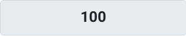

# Memory Bank 

## About the Game 
This game was inspired by the Human Benchmark game where you have a sequence of squares appear on the screen and you have to follow the pattern in order to get points. The more you get correct the more points you acrue over time. This game is to test your memory and eventually it will test your cognitive functions, such as reaction time to gauge where you are at personally. This game is designed in a way where any age group could play it to work on their ability to retain information and replay it. Also, sometimes these memory test can be seen during the pre-screening phase of a graduate role in IT. They will use a series of games and test your ability to retain information and use it to progress through the game. However, for this instance, the memory game will be the main focus of this website. 

## Strategy
### Goals
- One of the goals for this project is to challenge the user's capability to remember the sequence.
- Create a game that has an increasing level of difficulty for each round the user passes.
- Create multiple levels that increase in dimensions of squares the user has to play.
- Create easy navigation for the user to move around the website.
- Create 3 levels ranging from a 2x2 grid to a 4x4 grid.
- Making the game difficulty at a manageable level, making it more accesible to more players.

### Research
From looking at other memory games, I had noticed a lot of different functionalities that seemed interesting. One of the more notable examples was Human Benchmark. One of the more interesting things that they had in their game was a way to build on their previous sequence and keep adding one more item to the sequence the user started with. They also added some audio cues to help the user remember which block to press. 


The game starts with flashing one square and the game starts to create a longer sequence building off of the previous squares the user can remember. I like this idea but I will take my own spin on it by making each square a different colour and indicate a duplicate square in the series by placing a number on each square indicating that. Instead of having just one continuous level, I will have multiple levels with different grid matrixes from 2x2 to 4x4 with a cap on the increasing difficulty. 

### Target Audience
The intended audience for the game is for anyone who wants to assess their cognitive abilities. One target audience might also be job seekers looking for a role in IT as some companies require you to do an IQ test or a series of activities and questionnaires to assess if you're a right fit for the company. Being able to retain and reproduce information is one of the more important things to work on and it's the one game type that I tend to practice that game mode the most. It mainly targets short term memory as you need to look at a sequence and replay the same order of inputs as shown to the user. 

I noticed that when I was applying for many different graduate IT roles, one of the common games was something in relation to short term memory or working with information and using it. Since, it is relevant to me it can be relevant to other graduate students or prospective interns looking for work in the IT industry. 

### Wireframes
For this website, I want it to be more JavaScript heavy rather than design heavy so one of the things I will work towards is just using a simplistic design but still doing the best I can to make it pass all the validator pass checks. This game is more geared towards the mobile view but it can be played on desktop, mobiles and tablets. Here is the mobile view of the wireframe:


As you can see the basic design is a hero on the landing page with an easy and visible button that should re-route the user to the level select window. When you click one of the levels it will make the user navigate to the game window where you have to click the start button and the game will start working. For any levels that haven't been completed yet, the user will be sent to the coming-soon page which should redirect the user to back to the level select screen or back to the homepage screen. 

### Functions
#### **`getRandomIntInclusive()`**
```
function getRandomIntInclusive(min, max) {
    const minCeiled = Math.ceil(min);
    const maxFloored = Math.floor(max);
    return Math.floor(Math.random() * (maxFloored - minCeiled + 1) + minCeiled); // The maximum is inclusive and the minimum is inclusive
}
```
This function is from this website: 
[Math.Random() functions](https://developer.mozilla.org/en-US/docs/Web/JavaScript/Reference/Global_Objects/Math/random)

What this function does is that it creates a random integer from a given range between min and max including the min and max numbers. This function is important for creating a sequence of numbers for the sequenceMatch game to play. 

#### **`HideButtonX()`**
```
function hideButton1(){
    if(shownSequence === false){
        let button = document.getElementById("shape1");
        button.style.visibility = "hidden";
    }else{
        pointCheck(1);
    }
}
```
This function grabs an individual button and depending on whether there is a sequence being shown to the user it hides the button. If the sequence has been shown already or shownSequence is set to true, the function sends the specific button's number index to the **`pointCheck()`**. This function will be activated on whatever button it is assigned to but the naming convention instead of **`hideButtonX()`** it would instead be **`hideButton1()`** for button 1 for example. 

#### **`ShowButtonX()`**
```
function showButton1(){
    let button = document.getElementById("shape1");
    button.style.visibility = "visible";
}
```
This function sets the button to visible. The normal naming convention instead of **`showButtonX()`** it would instead be **`showButton1()`** if it's for `button 1`.

#### **`hideButtons()`**
```
function hideButtons(){
    hideButton1();
    hideButton2();
    hideButton3();
    hideButton4();
}
```
This function hides all buttons simulatenously. 

#### **`showButton()`**
```
function showButton(){
    showButton1();
    showButton2();
    showButton3();
    showButton4();
}
```
This function shows all buttons simultaneously. 

#### **`generateSequence()`**
```
function generateSequence(){
    for (let i = 0; i < maxInputs; i++){
        sequenceToMatch.push(getRandomIntInclusive(1,numberOfSquares));
    }
}
```
This function runs a for loop using the `maxInputs` variable as the condition for how many iterations to run through. `maxInputs` is a variable that sets how many buttons are in the sequence. For example, with level 1 the initial value assigned to `maxInputs` is set to 2 meaning the initial sequence will only have 2 values. So, this for loop will only have 2 iterations and push 2 random numbers onto the **`sequenceToMatch`** array using the **`getRandomIntInclusive()`** function. Inside of the for loop, the code uses the range between 1 and numberOfSqaures. Depending on the level, the webpage will have a different amount of buttons and a different js file. Level 1 uses the js file `script-game.js` and in that `numberOfSquares` would be equal to 4, level 2 `numberOfSquares` is set to 9 and level 3 will eventually be set to 16 which would be the max number of squares irregardless of difficulty, the difficulty will be increased in other ways. 

#### **`startMemorySequence()`**
```
function startMemorySequence(){
    document.getElementById('startBtnL2').disabled = true;
    sequenceToMatch = [];
    for (const t of activeTimeouts) clearTimeout(t);
    activeTimeouts = [];
    shownSequence = false;
    i=0;
    if(maxInputs <= lastRound){
        hideButtons();
        generateSequence();
        showButtonsPeriodically();
    }else{
        showEndGameModal();
        return;
    }   
}
```
This function starts everything up and resets all the relevant variables and data structures that may cause bugs if not emptied.  This function is attached to the `startBtn` button using the `onclick` event. The function also disables the `startBtn` button to ensure that you can't start playing multiple sequences on top of each other. It also clears any timers so that there isn't any overlapping old timers that aren't being used. It also sets `shownSequence` to false to allow for other functions to work amd replay the sequence created by **`generateSequence()`**. `i` is set to 0 as it will be the iterator for the **`showButtonsPeriodically()`** function. 
```
if(maxInputs <= lastRound){
    hideButtons();
    generateSequence();
    showButtonsPeriodically();
}else{
    showEndGameModal();
    return;
} 
```
Just to break down this if statement, `if(maxInputs <= lastRound)` checks whether `maxInputs` (which is the max number of squares in a sequence for a round) is less than the `lastRound` variable which is amount of squares going to be shown in the final round. For as long as condition is met, each round the game will hide the buttons, generate the sequence and then display the generated sequence on the screen using **`showButtonsPeriodically()`** function. If the condition isn't met (due to maxInputs being greater than lastRound) then it will show a modal window `showEndGameModal()` which will play an instance of `endGameModal` modal window.

#### **`showEndGameModal()`**
```
function showEndGameModal(){
    document.getElementById('finalScore').textContent = points;
    let percent = parseInt((points/highestScorePossible)*100);
    let percentScore = `${percent}%`;
    document.getElementById('finalPercentScore').textContent = percentScore;
    const endModal = new bootstrap.Modal(document.getElementById('endGameModal'));
    endModal.show();
}
```
This function sets all the score related variables and calculates the user's overall accuracy in percentage form and sets it to the elements in the modal window. It also uses the Bootstrap API to call a new modal instance using the HTML Modal container I created in HTML. This is the HTML that the function will recreate:
```
<div class="modal fade" id="endGameModal" tabindex="-1" aria-labelledby="endGameModalLabel" aria-hidden="true">
    <div class="modal-dialog modal-dialog-centered">
      <div class="modal-content rounded-4 shadow">
        <div class="modal-header border-bottom-0">
          <h1 class="modal-title fs-5" id="endGameModalLabel">Game Over</h1>
          <button type="button" class="btn-close" data-bs-dismiss="modal" aria-label="Close"></button>
        </div>
        <div class="modal-body">
          <h3>Great job! You've completed the game.</h3>
          <h4>Your Score: <span id="finalScore">0</span></h4>
          <h4><span id="finalPercentScore">0%</span></h4>
        </div>
        <div class="modal-footer border-top-0">
          <button type="button" class="btn btn-secondary" data-bs-dismiss="modal">Close</button>
          <button type="button" class="btn btn-primary" onclick="window.location.href='level-select.html'">Level Select</button>
          <button type="button" class="btn btn-primary" onclick="restartGame()">Play Again</button>
        </div>
      </div>
    </div>
</div>
```
And here is the Modal window when it is activated:


#### **`restartGame()`**
```
function restartGame(){
    const modalElement = document.getElementById("endGameModal");
    const modalInstance = bootstrap.Modal.getInstance(modalElement);
    if(modalInstance){
        modalInstance.hide();
    }
    maxInputs = 2;
    points = 0;
    updateScoreBoard();
    sequencePoints = 0;
    shownSequence = false;
    startMemorySequence();
}
```
Firstly, this function is attached to the `Play Again` button on the modal below. When it is clicked, the function assess whether there is a modal window open and since you can see the modal window most of the time (if there aren't any major bugs or misspellings for element names) and passes it into the `if(modalElement)` statement. If it's not empty (it most likely isn't) then the modal window is hidden and the game starts up again. It also resets all of the necessary variables like **`maxInputs`**, **`points`**, **`sequencePoints`** and **`shownSequence`** boolean. And it restart the sequence shown to the user just like it did the first go round.  


#### **`showButtonsPeriodically()`**
```
function showButtonsPeriodically(){
    setTimeout(function() {
        i=i+1; 
        if(i<maxInputs+1 && sequenceToMatch){
            const current = sequenceToMatch[i - 1];
            const prev = sequenceToMatch[i - 2];
            if (current === prev) {
                repeatCount++;
            } else {
                repeatCount = 1;
            }
            const squareElement = document.getElementById("square-label" + current);
            if (squareElement) {
                squareElement.innerText = repeatCount; 
            }
            if(sequenceToMatch[i-1] === 1){
                showButton1();
                const t = setTimeout(() => {hideButton1();
                }, 2000);
                activeTimeouts.push(t);
            }else if(sequenceToMatch[i-1] === 2){
                showButton2();
                const t = setTimeout(() => {hideButton2();
                }, 2000);
                activeTimeouts.push(t);
            }else if(sequenceToMatch[i-1] === 3){
                showButton3();
                const t = setTimeout(() => {hideButton3();
                }, 2000);
                activeTimeouts.push(t);
            }else if(sequenceToMatch[i-1] === 4){
                showButton4();
                const t = setTimeout(() => {hideButton4();
                }, 2000);
                activeTimeouts.push(t);
            }else{
                console.log("Something is wrong");
            }
            showButtonsPeriodically();
        }else if(i>=(maxInputs+1) && sequenceToMatch){
            showButton();
            shownSequence = true;
            i=0;    
        }
    },2000)
}
```
This is the beating heart and one of the most important functions that help make the game run. It combines all the prior functions and uses them together to make the button sequence run and show it to the user. This function works like a for loop but instead of using the normal `for (let i=0; i<x; i++ )` format, it uses recursion which instead of automatically incrementing with the for loop, the function instead calls itself if the condition is met; the condition for this function is `if(i<maxInputs && sequenceToMatch)` which checks if the iterator `i` is not greater than the maximum buttons stored in the `sequenceToMatch` array. If the iterator is greater or equal to `maxInputs` then the function will not access the sequence functionality and instead shows all the buttons in the `game-box` container and change the **`shownSequence`** boolean to true. Also, every iteration has a 2 second pause between each one to give the user enough time to remember the button shown to them. This is done by **`setTimeout()`**.

To break down the actual functionality for showing the sequence, here is the code:
```
const current = sequenceToMatch[i - 1];
const prev = sequenceToMatch[i - 2];
if (current === prev) {
    repeatCount++;
} else {
    repeatCount = 1;
}
const squareElement = document.getElementById("square-label" + current);
if (squareElement) {
    squareElement.innerText = repeatCount; 
}
```
The code above checks whether there are repeat numbers in the sequence and indicates it on the buttons. For example, if the sequence is: 43331. The code would increment the `repeatCount` number on the buttons on each iteration so the user can actively see where it repeats in the sequence. This is done by checking the current and previous item in the list. So once the sequence is over you could see something like the diagram below:

As you can see, the numbers on the squares all display the repeat values on the buttons and would function exactly the same in the real game. It would use the `square-labelX` x being the current number in the sequence for example, if it is **`sequenceToMatch[1]`** and **`sequenceToMatch[2]`** and both are equal to 3, the repeatCount (which equals 2) would be attacked to **`#square-label2`**. 

```
if(sequenceToMatch[i-1] === 1){
    showButton1();
    const t = setTimeout(() => {hideButton1();
    }, 2000);
    activeTimeouts.push(t);
}else if(sequenceToMatch[i-1] === 2){
    showButton2();
    const t = setTimeout(() => {hideButton2();
    }, 2000);
    activeTimeouts.push(t);
}else if(sequenceToMatch[i-1] === 3){
    showButton3();
    const t = setTimeout(() => {hideButton3();
    }, 2000);
    activeTimeouts.push(t);
}else if(sequenceToMatch[i-1] === 4){
    showButton4();
    const t = setTimeout(() => {hideButton4();
    }, 2000);
    activeTimeouts.push(t);
}else{
    console.log("Something is wrong");
}
showButtonsPeriodically();
```
After the check on whether there are repeats numbers in the sequence, the next thing to check is what number matches to what. If the current item in this iteration is a certain number, the corresponding square/button is shown. For example, if the sequence has 1 in that current iteration, then **`showButton1()`** will be used to show `button1`. Then a 2 second timer is used to give the user a bit of time to remember the button shown. Then adter the **`setTimeout()`** timer is over then **`hideButton1`** is shown straight after. It is then stored into the **`activeTimeouts`** array which would later make it easier to clear all of the previous timers for the next round. After, all of that the **`showButtonsPeriodically()`** function is called again and goes through all the same if statements and the iterator `i` is incremented after each recursion call. 

#### **`updateScoreBoard()`**
```
function updateScoreBoard(){
    document.getElementById("scoreBoard").value = points;
}
```
This update the score on the front end and increments or decrements on each correct choice the user makes. This function is used in the **`pointCheck()`** function which will be explained later. But when the user gets something right they get 100 points.


When the user chooses the wrong button in the sequence they get -50 points. 


#### **`pointCheck(square)`**
```
function pointCheck(squareX){
    let curSquare = sequenceToMatch.shift();
    if(squareX === curSquare && curSquare){
        points = points + 100;
        sequencePoints+=100;
        updateScoreBoard();
        if(playerInputs === maxInputs){
            changeBackgroundColor(sequencePoints);
            setTimeout(() => {changeBackgroundColor(1000000);
                }, 500);    
            correctInputs = 0;
            playerInputs = 0;
            sequencePoints = 0;
            maxInputs+=1;
            startMemorySequence();
            resetButtons();
        }
    }else if (squareX !== curSquare && curSquare){
        points = points - 50;
        sequencePoints-=50;
        updateScoreBoard();
        playerInputs+=1;
        if(playerInputs === maxInputs){
            changeBackgroundColor(sequencePoints);
            setTimeout(() => {changeBackgroundColor(1000000);
                }, 500);
            correctInputs = 0;
            playerInputs = 0;
            sequencePoints = 0;
            maxInputs+=1;
            startMemorySequence();
            resetButtons();
        }
    }else{
        console.log("Empty array or something went wrong");
    }
}
```
This is the whole function. At the very beginning, the function uses **`shift()`** function which grabs the first item in the array. The function is used on the **`sequenceToMatch`** array and assigns the first item to **`curSquare`**. Eventually, the **`sequenceToMatch`** array will be completely empty. I will split into 2 which one side handles when the user choose the right square and the when user chooses the wrong square. 

**When the user is right:**
```
if(squareX === curSquare && curSquare){
    points = points + 100;
    sequencePoints+=100;
    updateScoreBoard();
    if(playerInputs === maxInputs){
        changeBackgroundColor(sequencePoints);
        setTimeout(() => {changeBackgroundColor(1000000);
            }, 500);    
        correctInputs = 0;
        playerInputs = 0;
        sequencePoints = 0;
        maxInputs+=1;
        startMemorySequence();
        resetButtons();
    }
}
```
If **`squareX`** is the same as the **`curSqaure`** variable (the new first item in the **`sequenceToMatch`** array) the user's points will increment by 100 and the round points variable being **`sequencePoints`** will increment by 100. The **`sequencePoints`** variable will be essential for the **`changeBackgroundColor()`** function when showing to the user the degree to how correct they were. The score board is incremented by 100 using the **`updateScoreBoard()`** function and assigned to the scoreboard on the game window. If the user has entered a full sequence of their own, with the maximum amount of values in the sequence, the amount of points gotten for the whole round will be sent to the **`changeBackgroundColor()`** with the **`sequencePoints`** in the paremeters. Depending on how well the user matched the sequence the screen will flash a certain colour, then after half a second the screen will turn back to white. `maxInputs` will increment by 1, reset all the necessary variables, reset button labels to display 0 and start the next sequence. 

**When the user is wrong:**
```
else if (squareX !== curSquare && curSquare){
    points = points - 50;
    sequencePoints-=50;
    updateScoreBoard();
    playerInputs+=1;
    if(playerInputs === maxInputs){
        changeBackgroundColor(sequencePoints);
        setTimeout(() => {changeBackgroundColor(1000000);
            }, 500);
        correctInputs = 0;
        playerInputs = 0;
        sequencePoints = 0;
        maxInputs+=1;
        startMemorySequence();
        resetButtons();
    }
}
```
